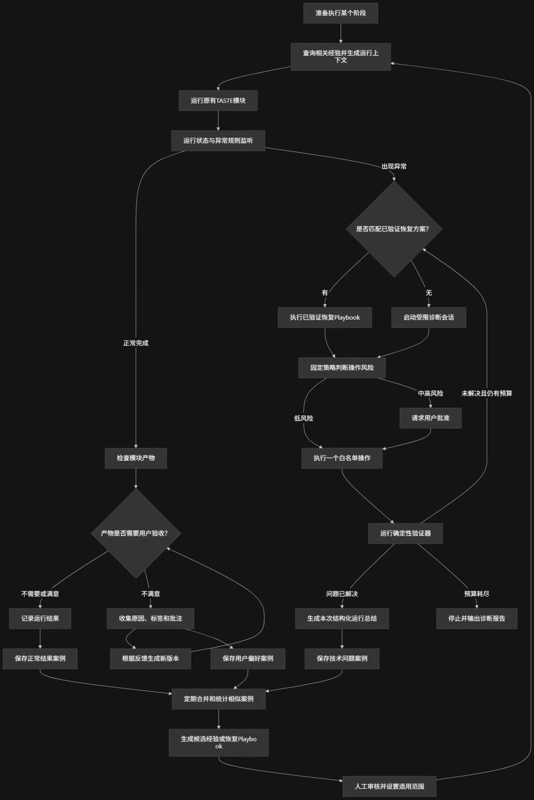
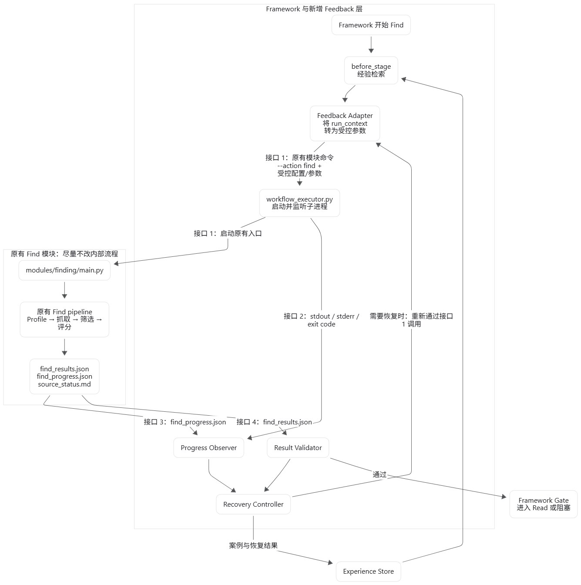
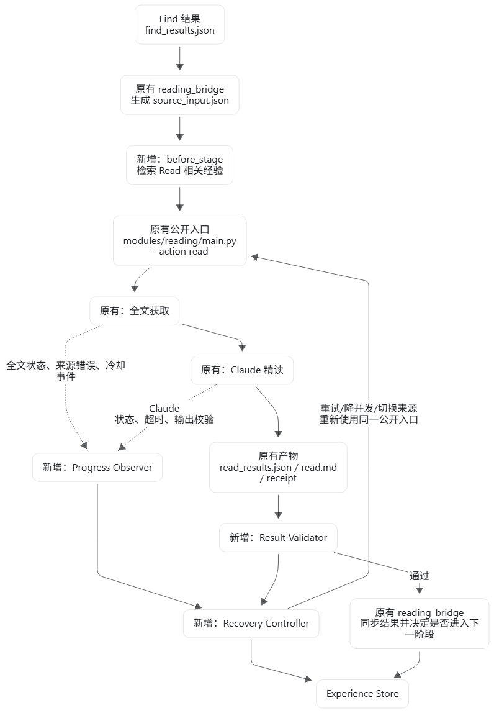

# TASTE 新版 Feedback 架构开发交接文档

> 更新日期：2026-09-02<br>
> 仓库：`D:\暑研\TASTE`<br>
> 当前分支：`main`<br>
> 当前重点：Find 运行前 Feedback 链路
> 本文用于说明目标架构、现有 Framework 接法、已经完成的内容、当前停点和后续开发顺序。

## 1. 项目目标

新版不是重写 Find 和 Read，而是在原有流程外围增加一层 Feedback 控制。

原有模块继续负责真正的业务工作：

- Find 继续检索、筛选和评分论文；
- Read 继续获取全文、调用 Claude 精读并生成阅读结果；
- Framework 继续组织阶段、启动模块、同步产物并更新网页任务状态。

新增外围层负责：

1. 运行前查找历史经验；
2. 把安全且适用的经验转换为本次运行参数；
3. 启动并监测原模块；
4. 检查运行产物是否真的可用；
5. 出现异常时整理证据并选择恢复办法；
6. 恢复后重新验证；
7. 记录本次结果，供以后查询。

核心原则是：**尽量不改 Find、Read 的内部 pipeline，只在 Framework 的公开入口周围接入新组件。**

## 2. 目标整体架构

以下三张图是本项目的目标架构依据。图中出现的组件不代表都已经实现，实际完成情况见第 6 节。

### 2.1 Feedback 通用控制架构



这张图说明所有阶段共用的控制逻辑：

```text
准备执行某个阶段
    ↓
查询相关经验并生成运行上下文
    ↓
运行原有 TASTE 模块
    ↓
监测运行状态和异常
    ├─ 正常完成 → 检查模块产物 → 记录结果
    └─ 出现异常 → 查询恢复经验 / 受限诊断
                     ↓
                 判断风险
                     ↓
              执行白名单恢复动作
                     ↓
                 确定性验证
```

低风险动作可以自动执行；中高风险动作要先获得用户批准。恢复预算耗尽后停止并输出诊断报告，不能无限重试。

### 2.2 Find Feedback 架构



Find 的完整目标数据流是：

```text
Framework 准备执行 Find
    ↓
before_stage 查询历史经验
    ↓
Feedback Adapter 生成 RunContext
    ↓
Workflow Executor 调用原 Find 公开入口
    ↓
原 Find pipeline 运行
    ├─ Progress Observer 读取进度、日志和进程状态
    └─ Result Validator 检查 find_results.json
                 ↓
          Recovery Controller
                 ↓
      Framework Gate 决定进入 Read 或阻塞
                 ↓
           Experience Store
```

### 2.3 Read Feedback 架构



Read 的完整目标数据流是：

```text
Find 结果 find_results.json
    ↓
reading_bridge 生成 source_input.json
    ↓
before_stage 查询 Read 经验
    ↓
原 Read 公开入口
    ├─ 全文获取
    └─ Claude 精读
          ↓
Progress Observer + Result Validator
          ↓
Recovery Controller
          ↓
reading_bridge 同步结果并决定是否进入下一阶段
          ↓
Experience Store
```

Read 的恢复范围应尽量限制到失败论文或失败步骤，不能因为一篇文章失败就重新运行 Find。

## 3. 新组件分别做什么

| 部分 | 输入 | 输出 | 作用 |
|---|---|---|---|
| Request Builder | Framework 已整理好的 Find 请求 | `FindStageRequest` | 把 Framework 的零散字段整理成统一请求 |
| Query Builder | `FindStageRequest` | `ExperienceQuery` | 生成经验库查询条件 |
| Experience Store | `ExperienceQuery` | `list[ExperienceCase]` | 从本地 JSON 读取并筛选历史经验 |
| Feedback Adapter | 当前请求、查询条件、匹配经验 | `RunContext` | 选择真正可采用的经验，形成最终运行方案 |
| Executor | `RunContext` | `ExecutionHandle` | 启动原 Find/Read，并返回进程事实 |
| Progress Observer | 进程、日志、进度文件 | `ProgressSnapshot` | 判断运行中、疑似停滞、失败或完成 |
| Result Validator | 当前运行目录和产物 | `ValidationResult` | 判断结果能否进入下一阶段 |
| Anomaly Builder | 进度证据和验证结果 | `Anomaly` | 把零散错误整理成一个明确异常 |
| Recovery Controller | 异常、历史经验、预算和风险 | `RecoveryDecision` | 决定重试、调整参数、请求批准或停止 |
| Supervisor | 事件和组件返回值 | `SupervisorState` | 按状态机组织整条控制流程 |
| Framework Gate | 验证结果和恢复结果 | 允许或阻塞 | 决定是否进入下一阶段 |
| Experience Recorder | 本次运行事实 | `ExperienceCase` | 把成功、失败或恢复结果写成经验案例 |

这里的 `ProgressSnapshot`、`ValidationResult`、`Anomaly` 等目前首先是“数据格式”。只有数据合同存在，不代表对应组件已经能在真实任务中运行。

## 4. 与原 Framework 的关系

### 4.1 原 Find 链路

```text
Web / 全流程请求
    ↓
project_bridge.py / run_project.py
    ↓
run_frontend.py
    ↓
modules/finding/main.py --action find
    ↓
Finding pipeline
    ↓
find_progress.json / find_results.json
    ↓
sync_outputs.py / reading_bridge.py
    ↓
Read
```

新版 Feedback 接在 `run_frontend.py` 启动 Find 之前和 Find 结束之后。原 `modules/finding/main.py --action find` 仍然是公开入口。

### 4.2 当前已经接上的真实 Find 链路

当前生产代码实际执行到这里：

```text
Web / Framework 控制字段
    ↓
project_bridge.py、run_project.py
    ↓
run_frontend.py
    ↓
build_find_stage_request()
    ↓
FindStageRequest
    ↓
build_experience_query()
    ↓
ExperienceQuery
    ↓
JsonExperienceStore.search_cases()
    ↓
matched_experiences
    ↓
原有 subprocess.Popen(find_cmd)
    ↓
原 Find 公开入口
```

这里最重要的边界是：`matched_experiences` 已经能够查出来，但当前 `run_frontend.py` **还没有调用 `FindFeedbackAdapter`**。因此查到的经验暂时不会修改 Find 参数。

### 4.3 Adapter 接入后的近期目标链路

```text
FindStageRequest
    ↓
ExperienceQuery
    ↓
JsonExperienceStore.search_cases()
    ↓
list[ExperienceCase]
    ↓
FindFeedbackAdapter.adapt()
    ↓
RunContext.effective_parameters
    ↓
写入本次运行专用 find.config.json
    ↓
原有 subprocess.Popen(find_cmd)
```

只应修改“本次运行专用”的 `find.config.json`。不要把经验调整后的参数写回项目长期配置，否则一次历史经验会永久覆盖用户原始设置。

### 4.4 原 Read 链路和未来接入点

```text
find_results.json
    ↓
reading_bridge.py 生成 source_input.json
    ↓
modules/reading/main.py --action read
    ↓
read_pipeline.py
    ↓
full_text_packet.json / receipt / read_results.json / read.md
    ↓
reading_bridge.py 同步结果
```

Read Feedback 以后接在以下位置：

- `source_input.json` 生成后：查询 Read 经验并生成上下文；
- Read 子进程运行中：观察全文、Claude receipt、日志和进程；
- Read 结束后：验证全文和精读产物是否属于同一运行；
- 验证失败时：只恢复未完成论文或失败步骤；
- 验证通过后：由 `reading_bridge.py` 同步明确的时间戳运行目录。

Read Feedback 目前尚未开始生产接入。

## 5. 当前数据合同和状态机

### 5.1 运行前和启动后信息严格分开

```text
FindStageRequest
    Framework 交给 Feedback 的原始 Find 请求

ExperienceQuery
    查询历史经验的条件

RunContext
    Adapter 生成的最终启动前方案

ExecutionHandle
    Find 启动后才产生的进程回执
```

`RunContext` 不保存真实 `run_id`、`run_dir`、PID 或退出码。因为这些信息在 Find 启动前并不存在。

真正启动后，以下事实放入 `ExecutionHandle` 或 `SupervisorState`：

- PID；
- 进程是否存活；
- 退出码；
- Find 创建的真实 `run_id`；
- 时间戳运行目录；
- stdout/stderr 位置。

这样避免把 Framework 请求编号、Feedback 编号和真实 Find 运行编号混成同一个 ID。

### 5.2 Supervisor 状态机

当前代码已经定义并验证：

- 13 个 `SupervisorStatus`；
- 23 个 `SupervisorEventType`；
- 12 个 `SupervisorCommand`；
- 40 条无副作用的状态转换规则。

状态流的主线是：

```text
IDLE
  ↓
PREPARING
  ↓
RUNNING
  ↓
VALIDATING
  ├─ 通过 → GATING → COMPLETED
  └─ 阻塞 → DIAGNOSING → DECIDING
                         ├─ 低风险恢复 → RECOVERING → RUNNING
                         ├─ 中高风险 → AWAITING_APPROVAL
                         └─ 无法恢复 → BLOCKED / FAILED
```

当前状态机只是纯规则和状态更新函数，还没有 Supervisor 主循环去实际调用 Adapter、Executor、Observer 等组件。

## 6. 已经完成的部分

### 6.1 数据合同与公共导出

已完成：

- `FindStageRequest`
- `ExperienceQuery`
- `RunContext`
- `ExecutionHandle`
- `ProgressSnapshot`
- `ValidationResult`
- `Anomaly`
- `RecoveryDecision`
- `ExperienceCase`
- `SupervisorState`
- 相关枚举、内嵌结构、JSON 序列化和字段校验

位置：

- `framework/scripts/feedback/contracts.py`
- `framework/scripts/feedback/__init__.py`

### 6.2 FindStageRequest Builder

已完成并接入生产链路：

```python
build_find_stage_request(...) -> FindStageRequest
```

它把 Framework 已经解析好的研究主题、来源选择、配置路径、请求参数、工作目录和控制字段整理成统一请求。

位置：`framework/scripts/feedback/request_builder.py`

### 6.3 ExperienceQuery Builder

已完成并接入生产链路：

```python
build_experience_query(request, required_context_tags=[], limit=5)
    -> ExperienceQuery
```

V0 查询条件保持简单：

- 当前项目或全局经验；
- `normal / technical / preference` 三类案例；
- 只取 `success / recovered`；
- 默认只取已验证且未废弃案例；
- 最多 5 条；
- 标签只接受调用方明确传入，不根据主题自动生成。

位置：`framework/scripts/feedback/query_builder.py`

### 6.4 Experience Store V0

接口和只读实现都已完成，并已接入 `run_frontend.py`：

```python
ExperienceStore.search_cases(query) -> list[ExperienceCase]
```

`JsonExperienceStore` 的职责只有：

1. 读取本地 JSON 数组；
2. 用 `ExperienceCase.from_dict()` 校验每条案例；
3. 根据 `ExperienceQuery` 过滤；
4. 稳定排序并限制返回数量。

当前生产路径：

```text
D:\暑研\TASTE\.runtime\feedback\experience_cases.json
```

文件不存在或内容为 `[]` 时返回空列表，原 Find 仍可继续。V0 不创建经验文件，也不提供写入、更新或删除。

位置：`framework/scripts/feedback/experience_store.py`

### 6.5 Feedback Adapter V0

组件实现、接口和单元测试已经完成，但尚未接入 `run_frontend.py`。

接口：

```python
adapt(
    request: FindStageRequest,
    experience_query: ExperienceQuery,
    experiences: list[ExperienceCase],
) -> RunContext
```

当前安全规则：

- 只采用 `verified=true`；
- 排除 `deprecated=true`；
- 只采用 `success` 或 `recovered`；
- 只采用 `RiskLevel.LOW`；
- 只允许修改 4 个正整数参数：
  - `abstract_scoring_max_workers`
  - `abstract_scoring_batch_size`
  - `abstract_scoring_timeout_sec`
  - `arxiv_timeout_sec`
- 参数必须已经存在于本次请求；
- `before` 有值时必须等于当前值；
- 多条经验修改同一参数时，按 Store 返回顺序采用第一条有效修改；
- `requested_parameters` 保留原值；
- 修改结果放入 `effective_parameters`；
- 同时记录匹配经验、实际采用经验和参数变更。

空经验时：

```text
requested_parameters == effective_parameters
```

因此 Adapter 接入后，即使经验库为空，也应保持原 Find 行为。

位置：`framework/scripts/feedback/feedback_adapter.py`

### 6.6 接口

已定义三个最小 Protocol：

- `ExperienceStore`
- `FeedbackAdapter`
- `Executor`

其中 Store 和 Adapter 已有实现；`Executor` 目前只有接口，没有真实 `subprocess` 实现。

位置：`framework/scripts/feedback/interfaces.py`

### 6.7 Framework 请求字段传递

已完成 Web/全流程到 `run_frontend.py` 的控制字段传递，包括：

- `request_source`
- `force_new_find`
- `restart_full_cycle`
- `human_approved_new_find`
- `approval_reason`

涉及：

- `web/backend/auto_research/web/server.py`
- `framework/scripts/bridges/project_bridge.py`
- `framework/scripts/orchestration/run_project.py`
- `framework/scripts/orchestration/run_frontend.py`

## 7. 当前准确停点

当前不是“还没开发 Adapter”，而是：

> **Adapter 已经作为独立组件完成，但生产链路只接到了 Experience Store。**

具体来说：

```text
已完成并接入：
Framework
→ FindStageRequest
→ ExperienceQuery
→ JsonExperienceStore
→ matched_experiences

已完成但未接入：
matched_experiences
→ FindFeedbackAdapter
→ RunContext

尚未完成：
RunContext.effective_parameters
→ 本次运行 find.config.json
→ 原 Find 真实启动
```

因此当前即使 JSON 经验库中有匹配案例，Find 仍使用原来的 `find_config_payload`。

## 8. 尚未完成的部分

### 8.1 近期必须完成

1. 在 `run_frontend.py` 调用 `FindFeedbackAdapter.adapt()`；
2. 使用 `RunContext.effective_parameters` 生成本次运行专用 `find.config.json`；
3. 验证空经验时配置完全不变；
4. 验证安全经验只能改变白名单参数；
5. 保持原 Find 命令和公开入口不变。

完成这些后，“Find 运行前查询经验并安全调整参数”才算真正端到端生效。

### 8.2 后续外围组件

尚未实现或尚未生产接入：

- 真实 Executor / `ExecutionHandle` 回填；
- Find Progress Observer；
- Find Result Validator；
- Anomaly Builder；
- Recovery Controller；
- Supervisor 主循环；
- Framework Gate；
- Experience Recorder 和 Store 写入；
- Read Feedback 的 Builder、Store 查询、Adapter、Observer、Validator 和恢复链路。

### 8.3 经验库当前没有自动数据来源

Store 目前只读。真实运行不会自动生成 `ExperienceCase`。

在 Recorder 开发前，只能：

- 使用人工构造的合法 JSON 案例做测试；或
- 保持经验文件不存在/为空，验证系统不会影响原 Find。

## 9. 最精简实现约束

后续开发继续遵守以下边界：

1. 不重写原 Find/Read pipeline；
2. 不新建第二套同义合同、枚举或接口；
3. 不增加没有真实上游和下游的字段；
4. 不增加 request ID、query ID、指纹或数据库；
5. Experience Store V0 使用单个本地 JSON 数组；
6. Query Builder 不调用 LLM，不自动猜标签；
7. Adapter V0 不把历史文本拼入研究主题或提示词；
8. Adapter 只允许低风险白名单参数调整；
9. `requested_parameters` 始终保留用户原始请求；
10. `effective_parameters` 才是本次实际采用的参数；
11. 查询到经验不等于采用经验，必须分别记录 matched 和 applied；
12. 空经验库必须保持原行为；
13. 运行前合同不保存启动后才出现的 run ID、PID 和运行目录；
14. 不自动重跑 Find，不无限恢复；
15. 中高风险动作必须等待用户批准；
16. 不读取或写入 API Key；
17. 不自动 commit、push 或创建 PR；
18. 不覆盖工作区已有未提交修改。

## 10. 推荐的下一批开发任务

下一批只做 Adapter 生产接入，不同时开发 Observer、恢复或 Recorder。

执行顺序：

1. 完整读取 `run_frontend.py` 当前生成 driver 的写文件顺序；
2. 在查询得到 `matched_experiences` 后实例化 `FindFeedbackAdapter`；
3. 调用 `adapt(find_stage_request, experience_query, matched_experiences)`；
4. 使用 `run_context.effective_parameters` 组成运行专用 `combined_find_config`；
5. 只重写 `input_dir/find.config.json`，不覆盖项目长期配置；
6. 保持 `selection_payload`、`input.json`、`find_cmd` 和 Popen 入口不变；
7. 增加生成 driver 的接线测试；
8. 增加空经验与安全参数调整测试；
9. 运行全部 `tests/feedback` 和相关 Framework bridge 测试；
10. 停止，不启动真实 Find、Web 或 Claude。

完成标准：

```text
空经验：实际配置 == 用户请求配置

合法低风险经验：
requested_parameters 保持原值
effective_parameters 发生白名单内变化
本次运行 find.config.json 使用 effective_parameters

非法、未验证、已废弃、中高风险或非白名单经验：
实际配置不变
```

## 11. 测试状态与测试方式

2026-09-02 实际复测结果：

```text
tests/feedback：349 passed in 3.29s
Framework 前置接线定向测试：4 passed, 115 deselected in 6.63s
```

运行命令：

```bash
wsl.exe -e bash -lc "cd '/mnt/d/暑研/TASTE' && /home/smera/miniforge3/envs/taste/bin/python -m pytest tests/feedback -q"
```

Framework 接线测试只检查生成代码、字段顺序和导入关系，没有启动真实 Find，也没有调用真实 LLM。

当前测试可以证明：

- 合同、状态机、Builder、Store 和 Adapter 的独立行为通过；
- Framework 能在 Find 启动前生成请求、查询经验；
- Adapter 的安全规则通过单元测试。

当前测试不能证明：

- 经验已经在真实运行中改变 Find 配置；
- Observer 能识别真实停滞；
- Validator 能阻止坏结果进入 Read；
- Recovery 能恢复真实故障；
- Read Feedback 已经接入。

## 12. 当前工作区说明

当前分支为 `main...origin/main`，工作区不是干净状态。Feedback 代码、测试、文档和架构图片仍包含未跟踪文件，此外还有多处既有修改。

接手后必须先执行：

```bash
git -c safe.directory='D:/暑研/TASTE' status --short --branch
git -c safe.directory='D:/暑研/TASTE' diff --check
```

不要清理、回滚或覆盖这些内容。此前开发均为本地修改，没有 commit、push 或 PR。

## 13. 关键文件索引

| 文件 | 当前用途 |
|---|---|
| `framework/scripts/feedback/contracts.py` | 数据合同、枚举和校验 |
| `framework/scripts/feedback/state_machine.py` | Supervisor 纯状态转换规则 |
| `framework/scripts/feedback/interfaces.py` | Store、Adapter、Executor 接口 |
| `framework/scripts/feedback/request_builder.py` | Framework 请求转 `FindStageRequest` |
| `framework/scripts/feedback/query_builder.py` | 请求转 `ExperienceQuery` |
| `framework/scripts/feedback/experience_store.py` | JSON 经验读取、筛选和排序 |
| `framework/scripts/feedback/feedback_adapter.py` | 安全采用经验并生成 `RunContext` |
| `framework/scripts/orchestration/run_frontend.py` | 当前 Find Feedback 生产接入点 |
| `framework/scripts/bridges/project_bridge.py` | Web/项目请求向 Framework 传递 |
| `framework/scripts/orchestration/run_project.py` | 全流程 Find 请求来源标记 |
| `web/backend/auto_research/web/server.py` | Web Find 控制字段上游 |
| `tests/feedback/` | Feedback 合同和组件测试 |
| `tests/test_web_framework_bridge.py` | Framework 生成 driver 和请求传递测试 |

## 14. 交接结论

当前已经完成了 Find Feedback 的基础合同、状态机、运行前请求整理、查询条件生成、只读经验查询和 Adapter 独立实现。

当前真正运行中的链路停在 `matched_experiences`。下一步不是继续增加新合同，而是把已经完成的 Adapter 接入 `run_frontend.py`，让 `RunContext.effective_parameters` 成为本次 Find 实际使用的配置。

该接入完成后，第一阶段“运行前经验反馈”才形成最小闭环。监测、结果验证、异常恢复、经验写入以及 Read Feedback 仍属于后续阶段。
