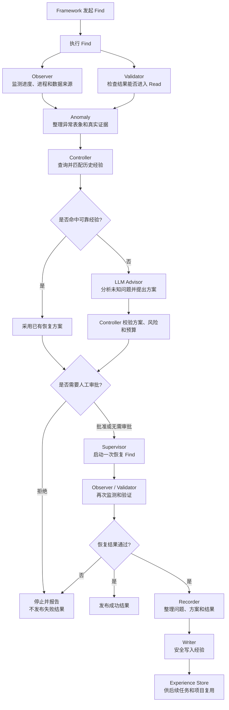

# 大研项目：TASTE Find Feedback

本项目位于 TASTE 仓库的 `find-feedback` 分支。

项目目标是在原有 Find 论文检索流程外增加一套反馈闭环：监测运行、识别异常、选择恢复方案、验证恢复结果，并把成功经验保存下来供以后复用。

## 1. 目标架构



这套架构采用“确定性检查优先、历史经验其次、LLM 处理未知问题”的顺序。Observer 和 Validator 负责提供事实；Anomaly 整理问题；Controller 决定如何恢复；Supervisor 负责执行和验证；Recorder、Writer 和 Store 负责保存成功经验。

## 2. 已完成的功能

- 已建立 Find 运行监测、终态验证、异常整理、恢复决策、人工审批和 Supervisor 编排的基础链路。
- 已验证“首次 Find 失败后，经批准只恢复一次，并只发布恢复成功结果”。
- 已增加发布门禁：结果未通过 Validator 时，不得发布 Find 结果，也不得更新 Read 的默认输入。
- 已建立结构化证据、经验适用条件和经验案例的数据合同，并支持旧版本数据安全迁移。
- 已实现本地经验的读取和筛选；未知问题可以进入 LLM Advisor，但 Advisor 的输出仍需 Controller 校验。
- 已修正数据来源状态的重复统计问题，为后续可靠诊断来源异常提供基础。

## 3. 当前进展

当前正在建设基于“证据—基准—根因”的诊断与经验匹配机制。现有 `Anomaly.kind` 只能描述异常表象，例如运行停滞或推荐结果为空，无法说明异常产生的具体原因。因此，系统需要采集真实运行证据，将证据与经验中的基准条件进行比较，从而判断可能的根因，再根据根因匹配相应的恢复经验。

目前正在进行的“真实证据接线”正是实现这套机制的第一步。数据合同已经能够保存证据，但 Observer 还没有把监测到的数值写入这些合同。

第一批准备接入的事实是：

- 无进展持续时间；
- 实际数据来源总数；
- 被限流的数据来源数量。

本阶段最重要的问题是区分两种情况：实际观测结果为 `0`，以及因为文件缺失或解析失败而根本没有取得结果。前者可以作为证据，后者不能伪造成 `0`。

完成这一步后，将依次推进：Anomaly 传播证据、Controller 按条件匹配经验、Advisor 提出未知问题的新证据需求、Supervisor 在恢复运行中采集新证据，以及 Recorder/Writer 保存成功经验。

## 4. 代码分层

| 层次 | 作用 |
|---|---|
| 数据合同层 | 统一各组件交换的数据格式，并检查类型、版本、身份和安全边界 |
| 监测与验证层 | 从真实 Find 运行中取得进度、进程、来源和结果事实 |
| 诊断与决策层 | 整理异常、查询经验，并在需要时调用 LLM Advisor |
| 编排与接入层 | 串联审批、恢复、验证和最终发布流程 |
| 经验层 | 读取、整理和持久化成功恢复经验 |
| 测试层 | 验证上述功能，防止后续修改破坏已经完成的行为 |

## 5. 主要代码位置

```text
TASTE/
├── framework/scripts/feedback/
│   ├── contracts.py          # 数据合同、结构化证据和经验案例
│   ├── interfaces.py         # 组件接口与职责边界
│   ├── observer.py           # 监测 Find 运行进度和来源状态
│   ├── validator.py          # 验证 Find 最终结果
│   ├── anomaly.py            # 整理异常表象和证据
│   ├── controller.py         # 匹配经验并选择恢复方案
│   ├── advisor.py            # 使用 LLM 分析未知问题
│   ├── approval.py           # 人工批准和拒绝
│   ├── supervisor.py         # 协调整个反馈与恢复流程
│   ├── state_machine.py      # Supervisor 状态转换
│   ├── executor.py           # 启动和跟踪 Find 进程
│   ├── experience_store.py   # 读取和筛选经验
│   └── feedback_adapter.py   # 将 Feedback 接入原 Find 流程
├── framework/scripts/orchestration/
│   └── run_frontend.py       # 生产入口、恢复执行和发布门禁
├── web/backend/auto_research/web/
│   └── server.py             # 人工审批后端接口
├── docs/architecture/
│   └── find-feedback-learning-semantics.md
│                              # Feedback 学习闭环的语义说明
└── tests/
    ├── feedback/             # 各 Feedback 组件和数据合同的单元测试
    └── test_web_framework_bridge.py
                               # Feedback 与原 Framework 的集成测试
```

`tests/` 中的文件不是生产运行代码，而是自动检查程序。它们用于证明合同、监测、决策、审批、恢复次数和发布顺序符合预期。交接时应随代码一起提交，这样后续协作者修改代码后可以立即判断是否破坏已有功能。

## 6. 当前验证状态

- Feedback 单元测试：1074 项通过。
- Framework 集成测试：192 项通过。
- 代码格式检查通过。

这些结果表示已经完成的功能在当前代码中可以正常协作，且本次整理没有破坏原有行为。它们不表示尚未开发的证据生产、证据匹配和经验写入已经完成。
